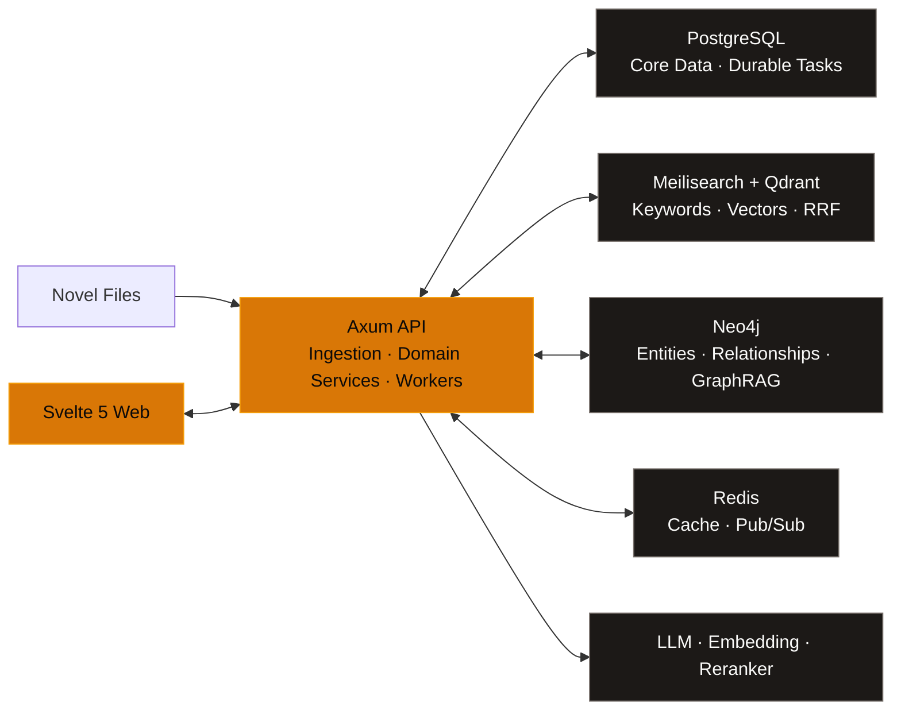

<p align="center">
  <a href="./README.md">简体中文</a> ·
  <strong>English</strong> ·
  <a href="./README.ja.md">日本語</a> ·
  <a href="./README.ko.md">한국어</a>
</p>

<p align="center">
  
</p>

<h1 align="center">Nova Reader</h1>

<p align="center">
  <strong>Your novels, on your own machine.</strong><br />
  Search, read, analyze, and deduplicate—all in one place.
</p>

<p align="center">
  <em>A local-first, AI-enhanced novel library and reader for personal homelabs.</em>
</p>

<p align="center">
  
  
  
</p>

<p align="center">
  <a href="#features">Features</a> ·
  <a href="#showcase">Showcase</a> ·
  <a href="#architecture">Architecture</a> ·
  <a href="#quick-start">Quick Start</a> ·
  <a href="#development">Development</a>
</p>

<p align="center">
  
</p>

<p align="center">
  <sub>Turn scattered novel files into a searchable, understandable, and ever-growing personal literary knowledge base.</sub>
</p>

Nova Reader is built for personal servers and homelabs. It turns the novels in your folders into a complete reading system: you retain control of the original files and core metadata, while search, reading progress, character relationships, content version review, and AI tools all share the same knowledge foundation.

> [!IMPORTANT]
> This project is under active development, and the database schema and some APIs may continue to evolve. Local development or personal homelab use is currently recommended.

<a id="features"></a>

## Features

<table>
  <tr>
    <td width="50%" valign="top">
      <strong>🧩 Explainable Content Deduplication</strong><br /><br />
      Distinguishes exact duplicates, identical body text, contained versions, high overlap, and partial overlap; presents chapter-level matching evidence before you decide which version to keep.
    </td>
    <td width="50%" valign="top">
      <strong>⌕ Hybrid Full-Text Search</strong><br /><br />
      Combines keyword retrieval from Meilisearch and semantic retrieval from Qdrant through RRF, with optional reranking; supports searches for characters, plots, settings, and similar passages.
    </td>
  </tr>
  <tr>
    <td width="50%" valign="top">
      <strong>📖 Immersive Reading</strong><br /><br />
      Supports scrolling and pagination, single- and double-column layouts, typography controls, fullscreen mode, bookmarks, TTS, entity highlighting, and original, bilingual, translated, and hover-translation modes.
    </td>
    <td width="50%" valign="top">
      <strong>🗂️ Local Library Management</strong><br /><br />
      Scans and watches local directories; imports TXT, EPUB, PDF, DOC/DOCX, Markdown, and HTML; automatically splits books into chapters and manages series, tags, and reading progress in one place.
    </td>
  </tr>
  <tr>
    <td width="50%" valign="top">
      <strong>🕸️ Literary Knowledge Graph</strong><br /><br />
      Stores characters, organizations, locations, and events in Neo4j, enabling relationship exploration, timelines, multi-hop paths, and GraphRAG context.
    </td>
    <td width="50%" valign="top">
      <strong>✦ Translation & Writing Tools</strong><br /><br />
      Glossary-aware translation, summarization, entity extraction, smart tagging, style analysis, and a streaming writing assistant all share configurable AI services.
    </td>
  </tr>
</table>

<a id="showcase"></a>

## Showcase

<details>
  <summary><strong>View the library, intelligent search, and duplicate detection workspaces</strong></summary>
  <br />
  <p><strong>Library Management</strong> — Browse, filter, and organize books in bulk across formats and reading states.</p>
  <p align="center">
    
  </p>
  <br />
  <p><strong>Intelligent Search</strong> — Switch between keyword, semantic, graph, global analysis, and cross-book comparison modes.</p>
  <p align="center">
    
  </p>
  <br />
  <p><strong>Duplicate Detection</strong> — Review scan progress, relationship classifications, chapter evidence, and manual resolutions in a single workspace.</p>
  <p align="center">
    
  </p>
</details>

<a id="architecture"></a>

## Architecture



- **PostgreSQL 16+** stores books, chapters, reading progress, domain data, and recoverable background tasks.
- **Meilisearch + Qdrant** handle keyword and vector retrieval respectively; results are fused with RRF and can optionally be reranked.
- **Neo4j** stores relationships among characters and events; **Redis** provides caching and pub/sub.
- **DeepSeek / Qwen / local rerankers** are integrated through configuration, without tying you to a single deployment model.

> [!NOTE]
> Your book files, metadata, and reading progress remain on your own infrastructure. When you enable an LLM, translation, or remote embedding service, relevant text is sent to the service endpoint configured in `.env`. The core library and reading features remain available without any AI API keys.

<a id="quick-start"></a>

## Quick Start

### Requirements

| Dependency | Recommended Version |
| --- | --- |
| macOS or Linux | Apple Silicon and x86_64 supported |
| Rust | 1.82+ |
| Node.js / pnpm | 22+ / 9+ |
| Docker + Compose | Latest stable release |
| Memory | 16 GB minimum, 32 GB recommended |

### 1. Start the Infrastructure and API

```bash
git clone https://github.com/TenviLi/nova-reader.git
cd nova-reader
cp .env.example .env

docker compose up -d
cargo run -p nova-api
```

By default, the API runs at `http://localhost:3000/api`. It automatically applies PostgreSQL migrations and starts the background task processors at launch.

### 2. Start the Web App

In another terminal, run:

```bash
cd nova-reader/apps/web
corepack enable
pnpm install --frozen-lockfile
pnpm dev
```

Open [http://localhost:5173](http://localhost:5173). On your first visit, the setup flow will prompt you to create the first administrator account.

<details>
  <summary><strong>Enable AI, vector search, and reranking</strong></summary>
  <br />
  <p>First, configure the required endpoints in <code>.env</code> at the repository root:</p>
  <ul>
    <li><code>DEEPSEEK_*</code>: summarization, translation, analysis, and writing tools</li>
    <li><code>EMBEDDING_*</code>: Qdrant / Meilisearch semantic indexes</li>
    <li><code>RERANKER_*</code>: optional local or remote result reranking</li>
  </ul>
  <p>Then initialize the search indexes:</p>

  ```bash
  set -a
  source .env
  set +a
  bash scripts/setup-search.sh
  ```
</details>

<a id="development"></a>

## Development

```bash
# Rust
cargo fmt --all -- --check
cargo test --workspace

# Svelte
cd apps/web
pnpm check
pnpm test
pnpm build
```

<details>
  <summary><strong>Repository Structure</strong></summary>
  <br />

  ```text
  nova-reader/
  ├── apps/web/           # Svelte 5 / SvelteKit frontend
  ├── crates/nova-api/    # Axum API and background tasks
  ├── crates/nova-core/   # Domain models and shared types
  ├── crates/nova-ingest/ # Document parsing, cleaning, and chapter splitting
  ├── crates/nova-search/ # Meilisearch, Qdrant, and RRF
  ├── crates/nova-graph/  # Neo4j and GraphRAG
  ├── crates/nova-embed/  # Chunking, embeddings, and similarity features
  ├── migrations/         # SQLx migrations
  └── scripts/            # Local operations and initialization scripts
  ```
</details>

Before opening an issue, please check the existing reports. For code contributions, see [CONTRIBUTING.md](./CONTRIBUTING.md); release changes are documented in [CHANGELOG.md](./CHANGELOG.md).

## License

This repository is currently distributed under the [GNU General Public License v3.0](./LICENSE).
