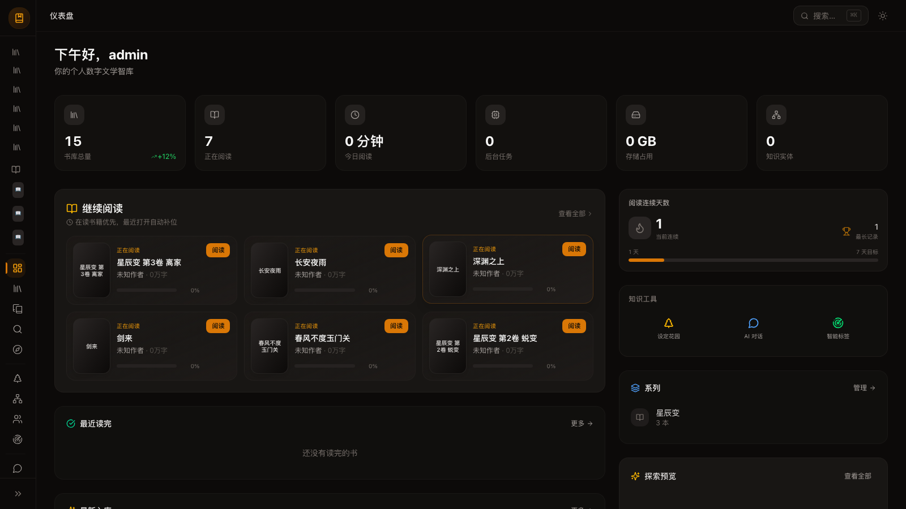
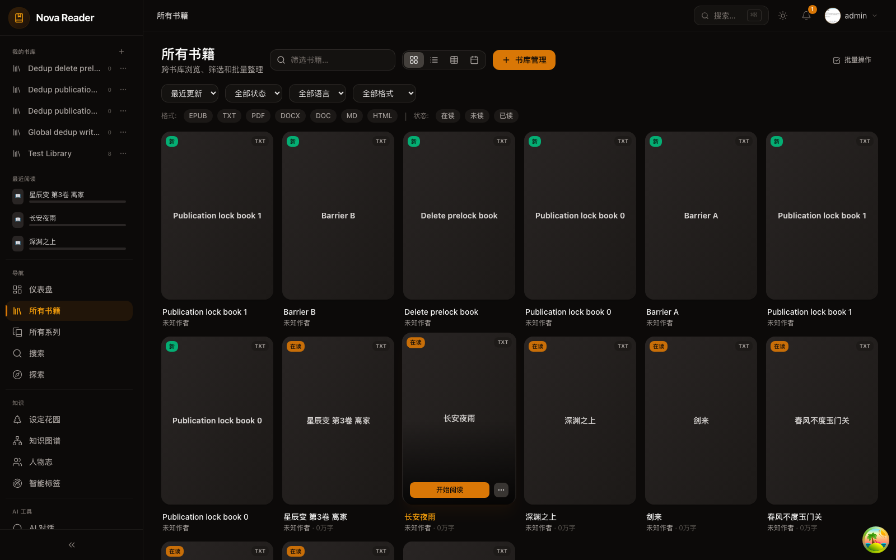
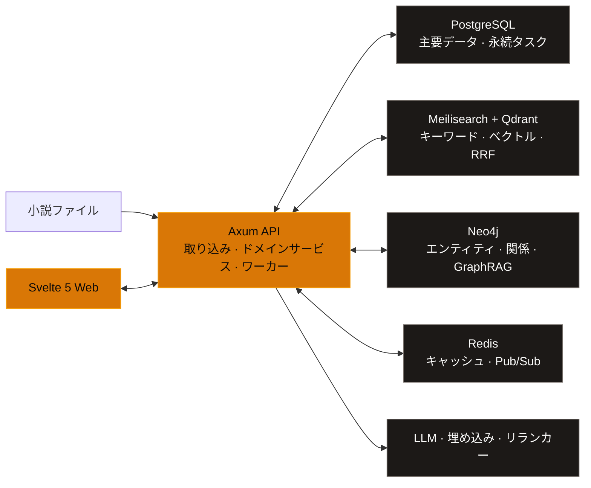

<p align="center">
  <a href="./README.md">简体中文</a> ·
  <a href="./README.en.md">English</a> ·
  <strong>日本語</strong> ·
  <a href="./README.ko.md">한국어</a>
</p>

<p align="center">
  
</p>

<h1 align="center">Nova Reader</h1>

<p align="center">
  <strong>あなたの小説を、あなた自身のマシンに。</strong><br />
  検索、読書、分析、重複排除を、ひとつの場所で。
</p>

<p align="center">
  <em>個人の Homelab のための、ローカルファーストで AI を活用した小説ライブラリ＆リーダー。</em>
</p>

<p align="center">
  
  
  
</p>

<p align="center">
  <a href="#features">主な機能</a> ·
  <a href="#showcase">画面プレビュー</a> ·
  <a href="#architecture">システム構成</a> ·
  <a href="#quick-start">クイックスタート</a> ·
  <a href="#development">開発に参加</a>
</p>

<p align="center">
  
</p>

<p align="center">
  <sub>散在する小説ファイルを、検索でき、理解でき、継続的に育てられる個人の文学ナレッジベースへ。</sub>
</p>

Nova Reader は、個人サーバーと Homelab 向けに設計されています。フォルダー内の小説を、実用的な読書システムとして整理します。原本ファイルと主要なメタデータはあなた自身が管理し、検索、読書進捗、人物関係、コンテンツのバージョン確認、AI ツールは共通のナレッジ基盤を利用します。

> [!IMPORTANT]
> このプロジェクトは現在も活発に開発中であり、データベース構造や一部の API は今後も変更される可能性があります。現時点では、ローカルでの開発または個人の Homelab での利用を推奨します。

<a id="features"></a>

## 主な機能

<table>
  <tr>
    <td width="50%" valign="top">
      <strong>🧩 根拠を確認できる重複排除</strong><br /><br />
      完全な重複、本文が同一のもの、収録版、高い重複率、部分的な重複を識別。章ごとに一致の根拠を表示し、どの版を残すかはユーザーが確認して決定できます。
    </td>
    <td width="50%" valign="top">
      <strong>⌕ ハイブリッド全文検索</strong><br /><br />
      Meilisearch によるキーワード検索と Qdrant によるセマンティック検索を RRF で統合し、必要に応じて reranker を利用可能。登場人物、プロット、設定、類似箇所を検索できます。
    </td>
  </tr>
  <tr>
    <td width="50%" valign="top">
      <strong>📖 没入型リーディング</strong><br /><br />
      スクロールとページ送り、1・2 カラム表示、フォントと組版、フルスクリーン、ブックマーク、TTS、エンティティのハイライトに対応。原文、バイリンガル、翻訳文、ホバー翻訳の各モードも利用できます。
    </td>
    <td width="50%" valign="top">
      <strong>🗂️ ローカルライブラリ管理</strong><br /><br />
      ローカルフォルダーをスキャンして変更を監視し、TXT、EPUB、PDF、DOC/DOCX、Markdown、HTML を取り込みます。章を自動で分割し、シリーズ、タグ、進捗を一元管理します。
    </td>
  </tr>
  <tr>
    <td width="50%" valign="top">
      <strong>🕸️ 文学ナレッジグラフ</strong><br /><br />
      登場人物、組織、場所、出来事を Neo4j に保存し、関係の閲覧、タイムライン、マルチホップ経路、GraphRAG コンテキストを利用できます。
    </td>
    <td width="50%" valign="top">
      <strong>✦ 翻訳・創作ツール</strong><br /><br />
      用語集を考慮した翻訳、要約、エンティティ抽出、スマートタグ、文体分析、ストリーミング対応の執筆アシスタントが、設定可能な共通の AI サービスを利用します。
    </td>
  </tr>
</table>

<a id="showcase"></a>

## 画面プレビュー

<details>
  <summary><strong>ライブラリ、スマート検索、重複検出ワークスペースを表示</strong></summary>
  <br />
  <p><strong>ライブラリ管理</strong> — 形式や読書状況の異なる蔵書を閲覧、絞り込み、一括整理できます。</p>
  <p align="center">
    
  </p>
  <br />
  <p><strong>スマート検索</strong> — キーワード、セマンティック、グラフ、全体分析、書籍間比較を切り替えられます。</p>
  <p align="center">
    
  </p>
  <br />
  <p><strong>重複検出</strong> — スキャン進捗、関係の分類、章ごとの根拠、手動での対応をひとつのワークスペースに集約します。</p>
  <p align="center">
    
  </p>
</details>

<a id="architecture"></a>

## システム構成



- **PostgreSQL 16+** は、書籍、章、進捗、ドメインデータ、復旧可能なバックグラウンドタスクを保存します。
- **Meilisearch + Qdrant** は、それぞれキーワード検索とベクトル検索を担い、結果は RRF で統合され、必要に応じて並べ替えられます。
- **Neo4j** は登場人物や出来事の関係を管理し、**Redis** はキャッシュと Pub/Sub に使用されます。
- **DeepSeek / Qwen / ローカル reranker** はすべて設定によって接続され、特定のデプロイ方式に依存しません。

> [!NOTE]
> 蔵書ファイル、メタデータ、読書進捗は、あなた自身のインフラストラクチャに保存されます。LLM、翻訳、リモート embedding を有効にすると、関連するテキストは `.env` で設定したサービスエンドポイントへ送信されます。AI キーを設定しなくても、基本的なライブラリ機能と読書機能は利用できます。

<a id="quick-start"></a>

## クイックスタート

### 動作要件

| 依存関係 | 推奨バージョン |
| --- | --- |
| macOS または Linux | Apple Silicon と x86_64 の両方に対応 |
| Rust | 1.82+ |
| Node.js / pnpm | 22+ / 9+ |
| Docker + Compose | 現行の安定版 |
| メモリ | 最小 16 GB、推奨 32 GB |

### 1. インフラストラクチャと API を起動

```bash
git clone https://github.com/TenviLi/nova-reader.git
cd nova-reader
cp .env.example .env

docker compose up -d
cargo run -p nova-api
```

API はデフォルトで `http://localhost:3000/api` で動作します。起動時に PostgreSQL migrations が自動的に適用され、バックグラウンドタスクプロセッサーも起動します。

### 2. Web を起動

別のターミナルで次を実行します。

```bash
cd nova-reader/apps/web
corepack enable
pnpm install --frozen-lockfile
pnpm dev
```

[http://localhost:5173](http://localhost:5173) を開きます。初回アクセス時は初期設定に進み、最初の管理者アカウントを作成します。

<details>
  <summary><strong>AI、ベクトル検索、リランキングを有効にする</strong></summary>
  <br />
  <p>まず、ルートディレクトリの <code>.env</code> に必要なエンドポイントを設定します。</p>
  <ul>
    <li><code>DEEPSEEK_*</code>：要約、翻訳、分析、創作ツール</li>
    <li><code>EMBEDDING_*</code>：Qdrant / Meilisearch のセマンティックインデックス</li>
    <li><code>RERANKER_*</code>：オプションのローカルまたはリモートでの結果のリランキング</li>
  </ul>
  <p>続いて、検索インデックスを初期化します。</p>

  ```bash
  set -a
  source .env
  set +a
  bash scripts/setup-search.sh
  ```
</details>

<a id="development"></a>

## 開発に参加

```bash
# Rust
cargo fmt --all -- --check
cargo test --workspace

# Svelte
cd apps/web
pnpm check
pnpm test
pnpm build
```

<details>
  <summary><strong>リポジトリ構成</strong></summary>
  <br />

  ```text
  nova-reader/
  ├── apps/web/           # Svelte 5 / SvelteKit フロントエンド
  ├── crates/nova-api/    # Axum API とバックグラウンドタスク
  ├── crates/nova-core/   # ドメインモデルと共有型
  ├── crates/nova-ingest/ # ドキュメントの解析、クリーニング、章分割
  ├── crates/nova-search/ # Meilisearch、Qdrant、RRF
  ├── crates/nova-graph/  # Neo4j と GraphRAG
  ├── crates/nova-embed/  # チャンク分割、embedding、類似度機能
  ├── migrations/         # SQLx migrations
  └── scripts/            # ローカル運用・初期化スクリプト
  ```
</details>

Issue を投稿する前に既存の Issue を確認してください。コードへの貢献については [CONTRIBUTING.md](./CONTRIBUTING.md)、バージョンごとの変更点については [CHANGELOG.md](./CHANGELOG.md) を参照してください。

## ライセンス

このリポジトリは現在、[GNU General Public License v3.0](./LICENSE) のもとで公開されています。
