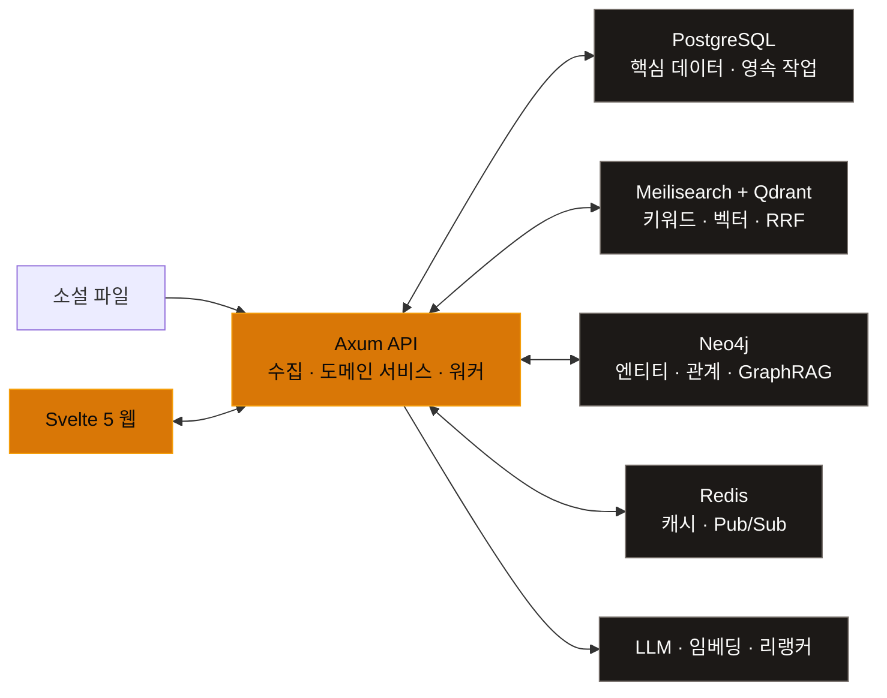

<p align="center">
  <a href="./README.md">简体中文</a> ·
  <a href="./README.en.md">English</a> ·
  <a href="./README.ja.md">日本語</a> ·
  <strong>한국어</strong>
</p>

<p align="center">
  
</p>

<h1 align="center">Nova Reader</h1>

<p align="center">
  <strong>당신의 소설을, 당신의 기기에 그대로.</strong><br />
  검색, 독서, 분석, 중복 제거를 한곳에서 해결하세요.
</p>

<p align="center">
  <em>개인 홈랩을 위한 로컬 우선, AI 강화 소설 라이브러리 및 리더.</em>
</p>

<p align="center">
  
  
  
</p>

<p align="center">
  <a href="#features">핵심 기능</a> ·
  <a href="#showcase">화면 미리보기</a> ·
  <a href="#architecture">시스템 아키텍처</a> ·
  <a href="#quick-start">빠른 시작</a> ·
  <a href="#development">개발 참여</a>
</p>

<p align="center">
  
</p>

<p align="center">
  <sub>흩어진 소설 파일을 검색하고 이해하며 꾸준히 축적할 수 있는 개인 문학 지식 기반으로.</sub>
</p>

Nova Reader는 개인 서버와 홈랩 환경을 위해 만들어졌습니다. 디렉터리에 흩어진 소설을 실제로 활용할 수 있는 독서 시스템으로 정리합니다. 원본 파일과 핵심 메타데이터는 사용자가 직접 관리하며, 검색, 독서 진행률, 인물 관계, 콘텐츠 버전 검토, AI 도구는 하나의 지식 기반을 공유합니다.

> [!IMPORTANT]
> 이 프로젝트는 현재 활발히 개발 중이며, 데이터베이스 구조와 일부 API는 계속 변경될 수 있습니다. 현재는 로컬 개발 환경이나 개인 홈랩에서 사용하는 것을 권장합니다.

<a id="features"></a>

## 핵심 기능

<table>
  <tr>
    <td width="50%" valign="top">
      <strong>🧩 설명 가능한 콘텐츠 중복 제거</strong><br /><br />
      완전 중복, 본문 동일, 수록 버전, 높은 중첩, 부분 중첩을 구분합니다. 장별로 일치 근거를 제시한 뒤 사용자가 보관할 버전을 직접 결정할 수 있습니다.
    </td>
    <td width="50%" valign="top">
      <strong>⌕ 하이브리드 전문 검색</strong><br /><br />
      Meilisearch의 키워드 검색 결과와 Qdrant의 시맨틱 검색 결과를 RRF로 융합하고, 선택적으로 리랭커를 연동할 수 있습니다. 인물, 줄거리, 세계관 설정, 유사 구절 검색을 지원합니다.
    </td>
  </tr>
  <tr>
    <td width="50%" valign="top">
      <strong>📖 몰입형 독서</strong><br /><br />
      스크롤 및 페이지 넘김, 1단·2단 레이아웃, 글꼴 조판, 전체 화면, 북마크, TTS, 엔티티 강조 표시를 제공합니다. 원문, 이중 언어, 번역문, 마우스 오버 번역 모드도 지원합니다.
    </td>
    <td width="50%" valign="top">
      <strong>🗂️ 로컬 라이브러리 관리</strong><br /><br />
      로컬 디렉터리를 스캔하고 변경 사항을 감시하며 TXT, EPUB, PDF, DOC/DOCX, Markdown, HTML을 가져옵니다. 챕터를 자동 분할하고 시리즈, 태그, 진행률을 통합 관리합니다.
    </td>
  </tr>
  <tr>
    <td width="50%" valign="top">
      <strong>🕸️ 문학 지식 그래프</strong><br /><br />
      인물, 조직, 장소, 사건을 Neo4j에 저장해 관계 탐색, 타임라인, 다중 홉 경로, GraphRAG 컨텍스트를 지원합니다.
    </td>
    <td width="50%" valign="top">
      <strong>✦ 번역 및 창작 도구</strong><br /><br />
      용어집 기반 번역, 요약, 엔티티 추출, 스마트 태그, 문체 분석, 스트리밍 글쓰기 도우미가 설정 가능한 AI 서비스를 함께 사용합니다.
    </td>
  </tr>
</table>

<a id="showcase"></a>

## 화면 미리보기

<details>
  <summary><strong>라이브러리, 스마트 검색, 중복 검토 워크스페이스 펼쳐 보기</strong></summary>
  <br />
  <p><strong>라이브러리 관리</strong> — 다양한 형식과 독서 상태의 도서를 탐색하고 필터링하며 일괄 정리합니다.</p>
  <p align="center">
    
  </p>
  <br />
  <p><strong>스마트 검색</strong> — 키워드, 시맨틱, 그래프, 전체 분석, 도서 간 비교 검색을 전환합니다.</p>
  <p align="center">
    
  </p>
  <br />
  <p><strong>중복 검토</strong> — 스캔 진행률, 관계 분류, 챕터 근거, 수동 처리를 하나의 워크스페이스에서 관리합니다.</p>
  <p align="center">
    
  </p>
</details>

<a id="architecture"></a>

## 시스템 아키텍처



- **PostgreSQL 16+**는 도서, 챕터, 진행률, 도메인 데이터, 복구 가능한 백그라운드 작업을 저장합니다.
- **Meilisearch + Qdrant**는 각각 키워드 검색과 벡터 검색을 담당하며, 결과를 RRF로 융합하고 선택적으로 재정렬합니다.
- **Neo4j**는 인물과 사건의 관계를 관리하고, **Redis**는 캐시와 Pub/Sub에 사용합니다.
- **DeepSeek / Qwen / 로컬 리랭커**는 모두 설정을 통해 연동되므로 특정 배포 방식에 종속되지 않습니다.

> [!NOTE]
> 도서 파일, 메타데이터, 독서 진행률은 사용자의 인프라에 저장됩니다. LLM, 번역, 원격 임베딩을 활성화하면 관련 텍스트가 `.env`에 설정한 서비스 엔드포인트로 전송됩니다. AI 키를 설정하지 않아도 기본 라이브러리 및 독서 기능을 사용할 수 있습니다.

<a id="quick-start"></a>

## 빠른 시작

### 시스템 요구 사항

| 요구 사항 | 권장 버전 |
| --- | --- |
| macOS 또는 Linux | Apple Silicon 및 x86_64 모두 지원 |
| Rust | 1.82+ |
| Node.js / pnpm | 22+ / 9+ |
| Docker + Compose | 최신 안정 버전 |
| 메모리 | 최소 16GB, 32GB 권장 |

### 1. 인프라 및 API 시작

```bash
git clone https://github.com/TenviLi/nova-reader.git
cd nova-reader
cp .env.example .env

docker compose up -d
cargo run -p nova-api
```

API는 기본적으로 `http://localhost:3000/api`에서 실행됩니다. 시작할 때 PostgreSQL migrations를 자동으로 적용하고 백그라운드 작업 처리기를 실행합니다.

### 2. 웹 시작

다른 터미널에서 다음 명령을 실행합니다.

```bash
cd nova-reader/apps/web
corepack enable
pnpm install --frozen-lockfile
pnpm dev
```

[http://localhost:5173](http://localhost:5173)을 엽니다. 처음 접속하면 초기 설정 절차가 시작되며 첫 번째 관리자 계정을 직접 생성할 수 있습니다.

<details>
  <summary><strong>AI, 벡터 검색, 재정렬 활성화</strong></summary>
  <br />
  <p>먼저 루트 디렉터리의 <code>.env</code>에 필요한 엔드포인트를 설정합니다.</p>
  <ul>
    <li><code>DEEPSEEK_*</code>: 요약, 번역, 분석, 창작 도구</li>
    <li><code>EMBEDDING_*</code>: Qdrant / Meilisearch 시맨틱 인덱스</li>
    <li><code>RERANKER_*</code>: 선택 가능한 로컬 또는 원격 결과 재정렬</li>
  </ul>
  <p>그런 다음 검색 인덱스를 초기화합니다.</p>

  ```bash
  set -a
  source .env
  set +a
  bash scripts/setup-search.sh
  ```
</details>

<a id="development"></a>

## 개발 참여

```bash
# Rust
cargo fmt --all -- --check
cargo test --workspace

# Svelte
cd apps/web
pnpm check
pnpm test
pnpm build
```

<details>
  <summary><strong>저장소 구조</strong></summary>
  <br />

  ```text
  nova-reader/
  ├── apps/web/           # Svelte 5 / SvelteKit 프런트엔드
  ├── crates/nova-api/    # Axum API 및 백그라운드 작업
  ├── crates/nova-core/   # 도메인 모델 및 공유 타입
  ├── crates/nova-ingest/ # 문서 파싱, 정리, 챕터 분할
  ├── crates/nova-search/ # Meilisearch, Qdrant 및 RRF
  ├── crates/nova-graph/  # Neo4j 및 GraphRAG
  ├── crates/nova-embed/  # 청킹, 임베딩, 유사도 기능
  ├── migrations/         # SQLx migrations
  └── scripts/            # 로컬 운영 및 초기화 스크립트
  ```
</details>

Issue를 제출하기 전에 기존 Issue를 먼저 확인해 주세요. 코드 기여 방법은 [CONTRIBUTING.md](./CONTRIBUTING.md)를 참고하고, 버전 변경 사항은 [CHANGELOG.md](./CHANGELOG.md)에서 확인할 수 있습니다.

## 라이선스

이 저장소는 현재 [GNU General Public License v3.0](./LICENSE)에 따라 배포됩니다.
