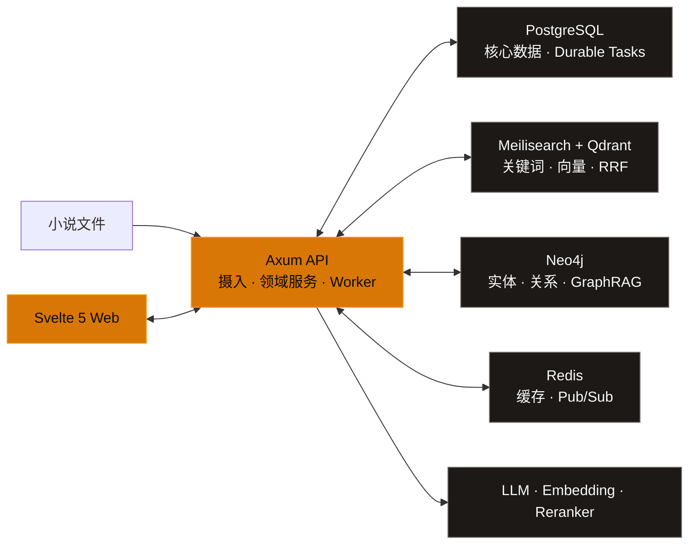

<p align="center">
  
</p>

<h1 align="center">Nova Reader</h1>

<p align="center">
  <strong>你的小说，留在自己的机器上。</strong><br />
  搜索、阅读、分析与去重，在一处完成。
</p>

<p align="center">
  <em>A local-first, AI-enhanced novel library and reader for personal homelabs.</em>
</p>

<p align="center">
  
  
  
</p>

<p align="center">
  <a href="#features">核心能力</a> ·
  <a href="#showcase">界面预览</a> ·
  <a href="#architecture">系统架构</a> ·
  <a href="#quick-start">快速开始</a> ·
  <a href="#development">参与开发</a>
</p>

<p align="center">
  
</p>

<p align="center">
  <sub>从散落的小说文件，到可检索、可理解、可持续积累的个人文学智库。</sub>
</p>

Nova Reader 面向个人服务器与 Homelab 场景。它把目录里的小说整理成一套真正可使用的阅读系统：原始文件和核心元数据由你掌握，搜索、阅读进度、人物关系、内容版本审阅与 AI 工具共享同一份知识底座。

> [!IMPORTANT]
> 项目仍在积极开发中，数据库结构与部分 API 可能继续演进。当前推荐本机开发或个人 Homelab 使用。

<a id="features"></a>

## 核心能力

<table>
  <tr>
    <td width="50%" valign="top">
      <strong>🧩 可解释的内容去重</strong><br /><br />
      区分完全重复、正文一致、收录版本、高重叠与部分重叠；按章节展示匹配证据，再由用户确认保留哪个版本。
    </td>
    <td width="50%" valign="top">
      <strong>⌕ 混合全文搜索</strong><br /><br />
      Meilisearch 关键词召回与 Qdrant 语义召回经 RRF 融合，可选接入 reranker；支持角色、情节、设定和相似片段检索。
    </td>
  </tr>
  <tr>
    <td width="50%" valign="top">
      <strong>📖 沉浸式阅读</strong><br /><br />
      提供滚动与分页、单双栏、字体排版、全屏、书签、TTS、实体高亮，以及原文、双语、译文和悬浮翻译模式。
    </td>
    <td width="50%" valign="top">
      <strong>🗂️ 本地书库管理</strong><br /><br />
      扫描并监听本地目录，摄入 TXT、EPUB、PDF、DOC/DOCX、Markdown 与 HTML；自动分章并统一管理系列、标签和进度。
    </td>
  </tr>
  <tr>
    <td width="50%" valign="top">
      <strong>🕸️ 文学知识图谱</strong><br /><br />
      把人物、组织、地点与事件写入 Neo4j，支持关系浏览、时间线、多跳路径与 GraphRAG 上下文。
    </td>
    <td width="50%" valign="top">
      <strong>✦ 翻译与创作工具</strong><br /><br />
      术语表感知翻译、摘要、实体提取、智能标签、风格分析与流式写作助手，共用可配置的 AI 服务。
    </td>
  </tr>
</table>

<a id="showcase"></a>

## 界面预览

<details>
  <summary><strong>展开查看智能搜索与重复检测工作台</strong></summary>
  <br />
  <p><strong>智能搜索</strong> — 在关键词、语义、图谱、全局分析与跨书对比之间切换。</p>
  <p align="center">
    
  </p>
  <br />
  <p><strong>重复检测</strong> — 扫描进度、关系分类、章节证据和人工处置集中在一个工作台中。</p>
  <p align="center">
    
  </p>
</details>

<a id="architecture"></a>

## 系统架构



- **PostgreSQL 16+** 保存书籍、章节、进度、领域数据与可恢复的后台任务。
- **Meilisearch + Qdrant** 分别负责关键词与向量召回，结果经 RRF 融合并可选重排。
- **Neo4j** 承载人物与事件关系；**Redis** 用于缓存和发布订阅。
- **DeepSeek / Qwen / 本地 reranker** 都通过配置接入，不绑定单一部署方式。

> [!NOTE]
> 藏书文件、元数据和阅读进度保存在你的基础设施中。启用 LLM、翻译或远程 embedding 后，相关文本会发送到你在 `.env` 中配置的服务端点；不配置 AI 密钥也可以使用基础书库与阅读功能。

<a id="quick-start"></a>

## 快速开始

### 环境要求

| 依赖 | 建议版本 |
| --- | --- |
| macOS 或 Linux | Apple Silicon 与 x86_64 均可 |
| Rust | 1.82+ |
| Node.js / pnpm | 22+ / 9+ |
| Docker + Compose | 当前稳定版 |
| 内存 | 最低 16 GB，推荐 32 GB |

### 1. 启动基础设施与 API

```bash
git clone https://github.com/TenviLi/nova-reader.git
cd nova-reader
cp .env.example .env

docker compose up -d
cargo run -p nova-api
```

API 默认运行在 `http://localhost:3000/api`，启动时会自动应用 PostgreSQL migrations，并启动后台任务处理器。

### 2. 启动 Web

在另一个终端中运行：

```bash
cd nova-reader/apps/web
corepack enable
pnpm install --frozen-lockfile
pnpm dev
```

打开 [http://localhost:5173](http://localhost:5173)。首次访问会进入初始化流程，由你创建第一个管理员账户。

<details>
  <summary><strong>开启 AI、向量检索与重排</strong></summary>
  <br />
  <p>先在根目录 <code>.env</code> 中配置需要的端点：</p>
  <ul>
    <li><code>DEEPSEEK_*</code>：总结、翻译、分析与创作工具</li>
    <li><code>EMBEDDING_*</code>：Qdrant / Meilisearch 语义索引</li>
    <li><code>RERANKER_*</code>：可选的本地或远程结果重排</li>
  </ul>
  <p>随后初始化搜索索引：</p>

  ```bash
  set -a
  source .env
  set +a
  bash scripts/setup-search.sh
  ```
</details>

<a id="development"></a>

## 参与开发

```bash
# Rust
cargo fmt --all -- --check
cargo test --workspace

# Svelte
cd apps/web
pnpm check
pnpm test
pnpm build
```

<details>
  <summary><strong>仓库结构</strong></summary>
  <br />

  ```text
  nova-reader/
  ├── apps/web/           # Svelte 5 / SvelteKit 前端
  ├── crates/nova-api/    # Axum API 与后台任务
  ├── crates/nova-core/   # 领域模型与共享类型
  ├── crates/nova-ingest/ # 文档解析、清洗与分章
  ├── crates/nova-search/ # Meilisearch、Qdrant 与 RRF
  ├── crates/nova-graph/  # Neo4j 与 GraphRAG
  ├── crates/nova-embed/  # 分块、嵌入与相似度能力
  ├── migrations/         # SQLx migrations
  └── scripts/            # 本地运维与初始化脚本
  ```
</details>

提交 Issue 前请先查看现有问题；贡献代码可参考 [CONTRIBUTING.md](./CONTRIBUTING.md)，版本变化记录在 [CHANGELOG.md](./CHANGELOG.md)。

## License

本仓库当前随 [GNU General Public License v3.0](./LICENSE) 发布。
